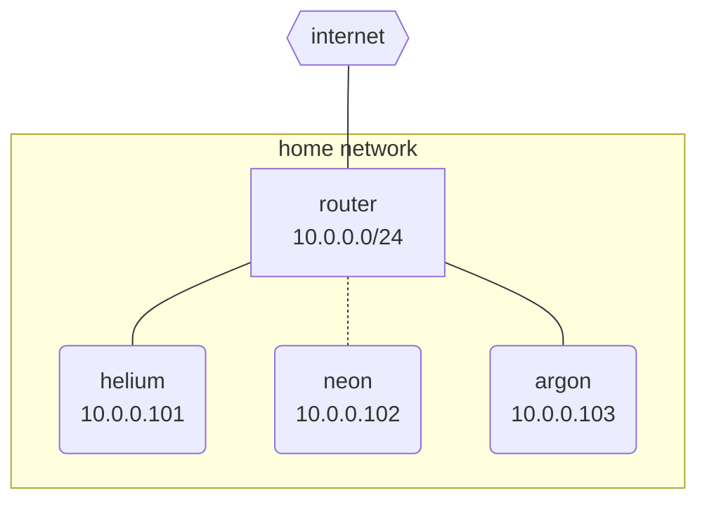

# Home 

## Network Diagram

```mermaid
graph TD
    internet{{<center>internet</center>}}
    router[<center>router<br>10.0.0.0/24</center>]
    helium(<center>helium<br>10.0.0.101</center>)
    neon(<center>neon<br>10.0.0.102</center>)
    argon(<center>argon<br>10.0.0.103</center>)

    internet---router

    subgraph "home network"
        router---helium
        router-.-neon
        router---argon
    end
```
