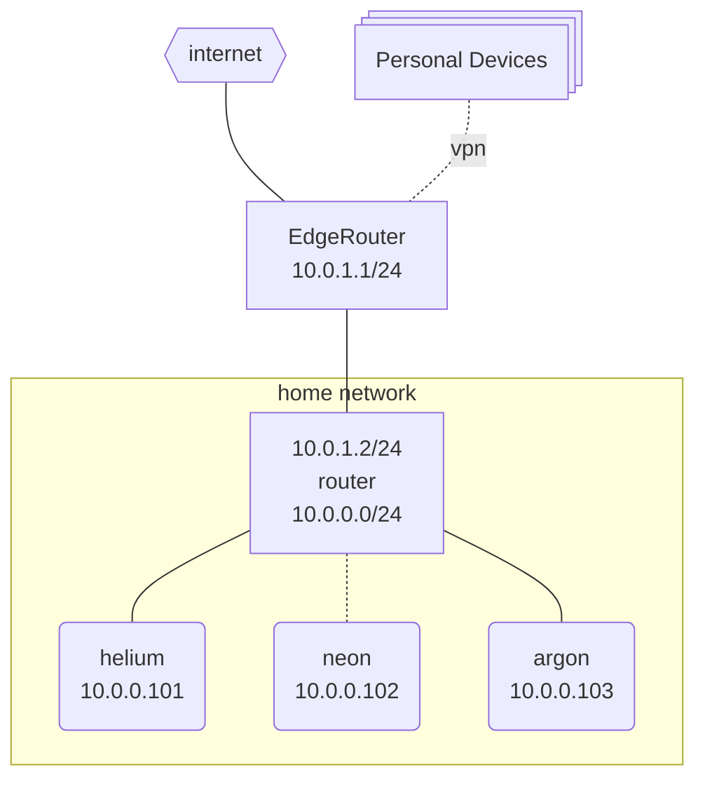

# Home 

[Documentation](docs/README.md)

## Network Diagram

```mermaid
graph TD
    internet{{<center>internet</center>}}
    krypton[<center>EdgeRouter<br>10.0.1.1/24</center>]
    router[<center>10.0.1.2/24<br>router<br>10.0.0.0/24</center>]
    helium(<center>helium<br>10.0.0.101</center>)
    neon(<center>neon<br>10.0.0.102</center>)
    argon(<center>argon<br>10.0.0.103</center>)
    personal_devices@{ shape: stacked-rectangle, label: <center>Personal Devices</center> }

    internet---krypton
    krypton---router
    personal_devices-.-|vpn|krypton

    subgraph "home network"
        router---helium
        router-.-neon
        router---argon
    end
```

```mermaid
  info
```